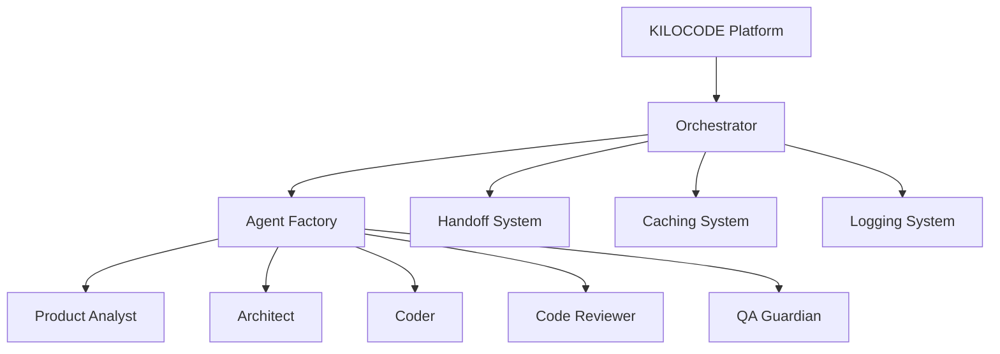

# KILOCODE Integration Guide
## Seamless Integration with the Autonomous Multi-Agent System

### 🎯 Overview

This guide explains how to integrate the **Autonomous Multi-Agent Software Development System** with **KILOCODE**, providing step-by-step instructions for setup, configuration, and usage within the KILOCODE environment.

## 🔗 Integration Architecture

### KILOCODE Compatible Design

The system is designed with KILOCODE compatibility in mind:

- **Standardized Agent Interfaces**: All agents follow KILOCODE's agent specification
- **MCP Protocol Support**: Full Model Context Protocol integration
- **Flexible Tool Integration**: Compatible with KILOCODE's tool ecosystem
- **Workflow Orchestration**: Seamless integration with KILOCODE's workflow management

### Integration Points



## 🛠️ Setup and Configuration

### Prerequisites

1. **KILOCODE Account**: Active KILOCODE subscription
2. **API Access**: KILOCODE API credentials
3. **System Requirements**: Python 3.8+, required dependencies
4. **Permissions**: Appropriate workspace access in KILOCODE

### Installation in KILOCODE Environment

#### Step 1: Create MCP Server Configuration

Create a new MCP server configuration file:

```json
{
  "name": "autonomous-multi-agent-system",
  "description": "Autonomous Multi-Agent Software Development System",
  "version": "1.0.0",
  "type": "stdio",
  "command": "python",
  "args": [
    "mcp_server.py"
  ],
  "env": {
    "PYTHONPATH": "./",
    "ORCHESTRATOR_MODE": "kilocode"
  }
}
```

#### Step 2: Create MCP Server Bridge

Create `mcp_server.py` in your project root:

```python
"""
MCP Server Bridge for KILOCODE Integration
Connects the Autonomous Multi-Agent System with KILOCODE
"""

import json
import asyncio
import sys
from typing import Dict, Any, List, Optional
from core.enhanced_orchestrator import EnhancedOrchestrator


class KilocodeOrchestrator:
    """KILOCODE-compatible orchestrator wrapper"""
    
    def __init__(self):
        self.orchestrator = EnhancedOrchestrator()
        self.active_sessions = {}
        
    async def handle_kilocode_request(self, request: Dict[str, Any]) -> Dict[str, Any]:
        """Handle incoming KILOCODE requests"""
        try:
            method = request.get('method')
            params = request.get('params', {})
            
            if method == 'start_workflow':
                return await self._start_workflow(params)
            elif method == 'get_workflow_status':
                return await self._get_workflow_status(params)
            elif method == 'process_agent_completion':
                return await self._process_agent_completion(params)
            elif method == 'handle_human_approval':
                return await self._handle_human_approval(params)
            elif method == 'list_agents':
                return await self._list_agents(params)
            else:
                return {'error': f'Unknown method: {method}'}
                
        except Exception as e:
            return {'error': str(e)}
    
    async def _start_workflow(self, params: Dict[str, Any]) -> Dict[str, Any]:
        """Start a new workflow"""
        request = params.get('request')
        workflow_type = params.get('workflow_type', 'complex_ui_feature')
        
        workflow_id = await self.orchestrator.start_workflow(
            request=request,
            workflow_type=workflow_type
        )
        
        return {
            'workflow_id': workflow_id,
            'status': 'started',
            'message': f'Workflow {workflow_id} started successfully'
        }
    
    async def _get_workflow_status(self, params: Dict[str, Any]) -> Dict[str, Any]:
        """Get workflow status"""
        workflow_id = params.get('workflow_id')
        
        if workflow_id not in self.orchestrator.active_workflows:
            return {'error': f'Workflow {workflow_id} not found'}
        
        workflow = self.orchestrator.active_workflows[workflow_id]
        return {
            'workflow_id': workflow_id,
            'status': workflow['status'],
            'current_agent': workflow.get('current_agent'),
            'current_phase': workflow.get('current_phase'),
            'progress': workflow.get('progress', 0)
        }
    
    async def _process_agent_completion(self, params: Dict[str, Any]) -> Dict[str, Any]:
        """Process agent completion"""
        task_id = params.get('task_id')
        agent_output = params.get('agent_output')
        session_id = params.get('session_id')
        
        result = await self.orchestrator.process_agent_completion(
            task_id=task_id,
            agent_output=agent_output,
            session_id=session_id
        )
        
        return result
    
    async def _handle_human_approval(self, params: Dict[str, Any]) -> Dict[str, Any]:
        """Handle human approval"""
        approval_id = params.get('approval_id')
        decision = params.get('decision')
        
        result = await self.orchestrator.process_human_approval(
            approval_id=approval_id,
            decision=decision
        )
        
        return result
    
    async def _list_agents(self, params: Dict[str, Any]) -> Dict[str, Any]:
        """List available agents"""
        agents = self.orchestrator.agent_factory.list_available_agents()
        return {
            'agents': agents,
            'count': len(agents)
        }


async def main():
    """Main MCP server loop"""
    kilocode_orchestrator = KilocodeOrchestrator()
    
    while True:
        try:
            # Read request from KILOCODE
            line = await asyncio.get_event_loop().run_in_executor(
                None, sys.stdin.readline
            )
            
            if not line:
                break
                
            request = json.loads(line.strip())
            
            # Process request
            response = await kilocode_orchestrator.handle_kilocode_request(request)
            
            # Send response back to KILOCODE
            print(json.dumps(response))
            sys.stdout.flush()
            
        except Exception as e:
            error_response = {'error': str(e)}
            print(json.dumps(error_response))
            sys.stdout.flush()

if __name__ == "__main__":
    asyncio.run(main())
```

#### Step 3: Configure KILOCODE Agents

Update your KILOCODE agent configurations to include the multi-agent system:

```json
{
  "agents": [
    {
      "name": "Autonomous Multi-Agent System",
      "type": "orchestrator",
      "mcp_server": "autonomous-multi-agent-system",
      "capabilities": [
        "workflow_orchestration",
        "multi_agent_coordination",
        "context_optimization",
        "human_approval_gates"
      ]
    }
  ]
}
```

## 🎮 Using the System in KILOCODE

### Starting a Workflow from KILOCODE

```python
# In KILOCODE environment
from kilocode import agent

# Initialize the orchestrator agent
orchestrator = agent.get_agent("Autonomous Multi-Agent System")

# Start a new workflow
result = await orchestrator.start_workflow(
    request="Create a REST API for user management with authentication",
    workflow_type="complex_ui_feature"
)

print(f"Workflow started: {result['workflow_id']}")
```

### Monitoring Progress

```python
# Check workflow status
status = await orchestrator.get_workflow_status(
    workflow_id=result['workflow_id']
)

print(f"Current status: {status['status']}")
print(f"Current agent: {status['current_agent']}")
print(f"Progress: {status['progress']}%")
```

### Handling Agent Interactions

```python
# Process agent completion
completion_result = await orchestrator.process_agent_completion(
    task_id="TASK-001",
    agent_output=agent_response,
    session_id=result['workflow_id']
)

if completion_result['status'] == 'human_approval_required':
    # Handle human approval in KILOCODE UI
    approval_response = await handle_approval_in_kilocode(
        approval_id=completion_result['approval_id']
    )
    
    # Submit approval decision
    await orchestrator.handle_human_approval(
        approval_id=completion_result['approval_id'],
        decision=approval_response
    )
```

## 🔧 Advanced KILOCODE Integration

### Custom Agent Creation

Create custom agents that work with both systems:

```python
class KilocodeCompatibleAgent:
    """Agent compatible with both KILOCODE and the multi-agent system"""
    
    def __init__(self, agent_name: str):
        self.agent_name = agent_name
        self.kilocode_mode = True
        
    async def execute_task(self, task: Dict[str, Any]) -> Dict[str, Any]:
        """Execute task in KILOCODE environment"""
        try:
            # Process task using multi-agent system capabilities
            result = await self._process_with_orchestrator(task)
            
            # Format response for KILOCODE
            return self._format_kilocode_response(result)
            
        except Exception as e:
            return {
                'status': 'error',
                'error': str(e),
                'agent': self.agent_name
            }
    
    async def _process_with_orchestrator(self, task: Dict[str, Any]) -> Dict[str, Any]:
        """Process task using the orchestrator"""
        # Implementation specific to the task and agent
        pass
    
    def _format_kilocode_response(self, result: Dict[str, Any]) -> Dict[str, Any]:
        """Format response for KILOCODE compatibility"""
        return {
            'status': 'success',
            'result': result,
            'agent': self.agent_name,
            'timestamp': datetime.now().isoformat()
        }
```

### Workflow Templates for KILOCODE

Create reusable workflow templates:

```json
{
  "name": "Full-Stack Feature Development",
  "description": "Complete feature development with multi-agent coordination",
  "template": {
    "workflow_type": "complex_ui_feature",
    "agents": [
      "Product_Analyst",
      "Architect", 
      "Coder",
      "Code_Reviewer",
      "QA_Guardian",
      "DevOps_Specialist"
    ],
    "human_approval_gates": [
      "after_architecture",
      "before_deployment"
    ],
    "context_optimization": true,
    "caching_enabled": true
  }
}
```

### Integration with KILOCODE Tools

```python
# Use KILOCODE tools within the multi-agent system
class KilocodeToolIntegration:
    """Integration with KILOCODE tools"""
    
    def __init__(self, kilocode_client):
        self.kilocode_client = kilocode_client
        
    async def use_kilocode_tool(self, tool_name: str, params: Dict[str, Any]) -> Dict[str, Any]:
        """Use KILOCODE tool from within the multi-agent system"""
        try:
            result = await self.kilocode_client.execute_tool(
                tool_name=tool_name,
                parameters=params
            )
            return result
        except Exception as e:
            return {'error': str(e)}
    
    async def sync_with_kilocode_workspace(self, workflow_id: str) -> Dict[str, Any]:
        """Sync workflow artifacts with KILOCODE workspace"""
        try:
            # Get workflow artifacts
            artifacts = await self.get_workflow_artifacts(workflow_id)
            
            # Upload to KILOCODE workspace
            for artifact in artifacts:
                await self.kilocode_client.upload_artifact(
                    file_path=artifact['path'],
                    content=artifact['content']
                )
            
            return {'status': 'synced', 'artifacts_count': len(artifacts)}
        except Exception as e:
            return {'error': str(e)}
```

## 🚀 Deployment in KILOCODE

### Step 1: Package the System

```bash
# Create a deployable package
python setup.py sdist bdist_wheel

# Create KILOCODE-compatible package
kilocode package create --name "autonomous-multi-agent-system" \
                       --version "1.0.0" \
                       --description "Autonomous Multi-Agent Software Development System"
```

### Step 2: Deploy to KILOCODE Environment

```bash
# Deploy to KILOCODE
kilocode deploy --package "autonomous-multi-agent-system" \
               --environment "production" \
               --config "kilocode_config.json"
```

### Step 3: Configure KILOCODE Integration

```json
{
  "integration": {
    "type": "multi_agent_system",
    "orchestrator": {
      "max_concurrent_workflows": 5,
      "context_optimization": true,
      "human_approval_gates": true,
      "caching_enabled": true
    },
    "agents": {
      "enabled": [
        "Product_Analyst",
        "Architect",
        "Coder",
        "Code_Reviewer",
        "QA_Guardian",
        "DevOps_Specialist",
        "Technical_Writer",
        "Security_Specialist"
      ]
    },
    "monitoring": {
      "logging_level": "INFO",
      "metrics_enabled": true,
      "performance_monitoring": true
    }
  }
}
```

## 🎯 Best Practices for KILOCODE Integration

### 1. **Workflow Design**
- Use KILOCODE's workflow designer for complex multi-step processes
- Leverage the multi-agent system for specialized tasks
- Implement proper error handling and recovery

### 2. **Agent Management**
- Register agents with KILOCODE's agent registry
- Use standardized agent interfaces
- Implement proper agent lifecycle management

### 3. **Context Optimization**
- Enable context optimization for better performance
- Use KILOCODE's context management features
- Implement proper caching strategies

### 4. **Monitoring and Logging**
- Integrate with KILOCODE's monitoring system
- Use structured logging for better debugging
- Implement performance metrics tracking

### 5. **Security**
- Follow KILOCODE's security guidelines
- Implement proper authentication and authorization
- Use secure communication protocols

## 🔍 Troubleshooting KILOCODE Integration

### Common Issues

#### 1. **MCP Server Connection Issues**
```python
# Check MCP server status
mcp_status = await kilocode_client.check_mcp_server_status(
    server_name="autonomous-multi-agent-system"
)

if mcp_status['status'] != 'connected':
    print(f"MCP server not connected: {mcp_status['error']}")
    # Restart MCP server
    await kilocode_client.restart_mcp_server(
        server_name="autonomous-multi-agent-system"
    )
```

#### 2. **Agent Not Available**
```python
# Check agent availability
available_agents = await orchestrator.list_agents()
if 'Coder' not in available_agents['agents']:
    print("Coder agent not available")
    # Restart agent or check configuration
```

#### 3. **Workflow Synchronization Issues**
```python
# Sync workflow state with KILOCODE
sync_result = await kilocode_tool_integration.sync_with_kilocode_workspace(
    workflow_id=workflow_id
)

if 'error' in sync_result:
    print(f"Sync failed: {sync_result['error']}")
    # Implement retry logic
```

### Debug Mode

Enable debug mode for detailed logging:

```python
# Enable debug mode
orchestrator.set_debug_mode(True)

# Enable KILOCODE integration debugging
kilocode_client.set_debug_mode(True)

# Get integration diagnostics
diagnostics = await get_integration_diagnostics()
print(json.dumps(diagnostics, indent=2))
```

## 📊 Performance Optimization

### Caching Strategy

```python
# Configure caching for KILOCODE environment
cache_config = {
    "llm_cache": {
        "enabled": True,
        "max_size": "500MB",
        "ttl": 3600  # 1 hour
    },
    "context_cache": {
        "enabled": True,
        "max_size": "200MB",
        "ttl": 1800  # 30 minutes
    },
    "kilocode_integration_cache": {
        "enabled": True,
        "max_size": "100MB",
        "ttl": 600  # 10 minutes
    }
}
```

### Load Balancing

```python
# Configure load balancing for multiple workflows
load_balancer_config = {
    "max_concurrent_workflows": 10,
    "agent_pool_size": 20,
    "resource_limits": {
        "cpu_percent": 80,
        "memory_mb": 4096
    }
}
```

## 🌟 Advanced Features

### Custom Workflow Types

```python
# Define custom workflow types for KILOCODE
custom_workflows = {
    "kilocode_feature_development": {
        "description": "KILOCODE-optimized feature development",
        "agents": ["Product_Analyst", "Architect", "Coder", "QA_Guardian"],
        "integration_points": ["kilocode_workspace", "kilocode_git"],
        "approval_gates": ["after_architecture", "before_deployment"]
    },
    "kilocode_bug_fix": {
        "description": "KILOCODE-optimized bug fixing",
        "agents": ["Debugger", "Coder", "QA_Guardian"],
        "integration_points": ["kilocode_issue_tracker", "kilocode_git"],
        "approval_gates": ["before_deployment"]
    }
}
```

### Real-time Collaboration

```python
# Enable real-time collaboration with KILOCODE users
collaboration_config = {
    "real_time_updates": True,
    "user_notifications": True,
    "shared_workspace": True,
    "collaborative_editing": True
}
```

## 📈 Monitoring and Analytics

### Integration Metrics

```python
# Track integration performance
integration_metrics = {
    "workflow_success_rate": 0.95,
    "average_completion_time": 1800,  # 30 minutes
    "kilocode_sync_success_rate": 0.98,
    "agent_utilization": 0.75,
    "cache_hit_rate": 0.85
}
```

### Custom Dashboards

Create custom dashboards in KILOCODE to monitor the multi-agent system:

```json
{
  "dashboard": {
    "name": "Multi-Agent System Monitor",
    "widgets": [
      {
        "type": "workflow_status",
        "title": "Active Workflows",
        "data_source": "orchestrator.active_workflows"
      },
      {
        "type": "agent_utilization",
        "title": "Agent Utilization",
        "data_source": "orchestrator.agent_metrics"
      },
      {
        "type": "performance_metrics",
        "title": "Performance Metrics",
        "data_source": "orchestrator.performance_stats"
      }
    ]
  }
}
```

---

*This integration guide provides comprehensive coverage for using the Autonomous Multi-Agent Software Development System within the KILOCODE environment. The system is designed to seamlessly integrate with KILOCODE's workflow management and agent orchestration capabilities.*
